# Secure Messaging System

## Description:
using the concepts of object oriented programming, this project creates a secure messaging environment with three types of users and respective roles. This project showcases the use of pillars of OOPs in data privacy and management.

Concepts Used:
* Classes and objects
* Inheritence
* Encapsulation
* Polymorphism
* Data Abstraction

GitHub Repository Link : https://github.com/pankhuriVarshney/secureMessaging

## Roles & Priveledges:
### 1. Admin: 
* admins can create such accounts with username and passwords
* verification required on every login
* can send messages to all users or to a particular user IDs
* can view all messages: including public and private messages between users

### 2. Regular Users:
* regular user accounts can create such accounts with username and passwords
* verification required on every login
* can send messages to particular user IDs
* can view public messages and private messages only involving themselves

### 3. Guests:
* no username or passwords required
* has temporary access without verification requirements
* can only view public messages visible to all users
* cannot send any messages

## Screenshots of Execution:
### *Main Menu*:
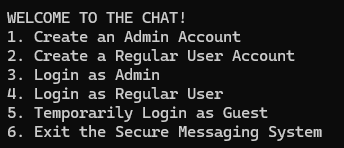

### *Admin Account:*
>#### Account Creation:
>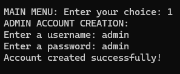

>#### Admin Login and Menu:
>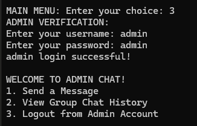

>#### Sending Messages to ALL users:
>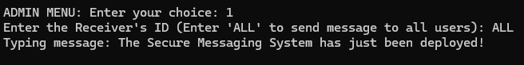

>#### Viewing Messages (Public and Private):
>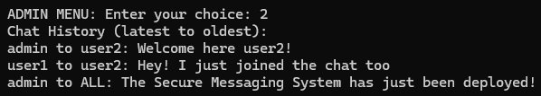

### *Regular User Account:*
>#### Account Creation:
>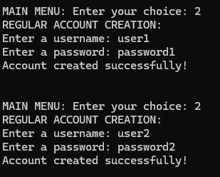

> #### User Login and Menu:
>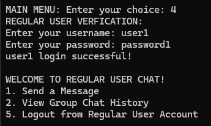

>#### Sending Messages to Other Users:
>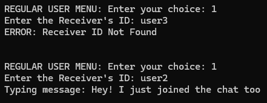

> #### Viewing Messages (Public and Personal):
>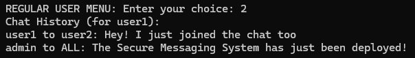

### *Guest Account:*
>#### Temporary Login:
>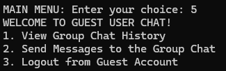

> #### Viewing Messages (Public Only):
>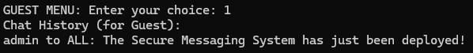

> #### Sending Messages (Denied):
>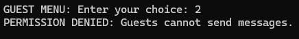

### *Exiting:*
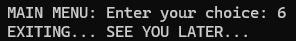